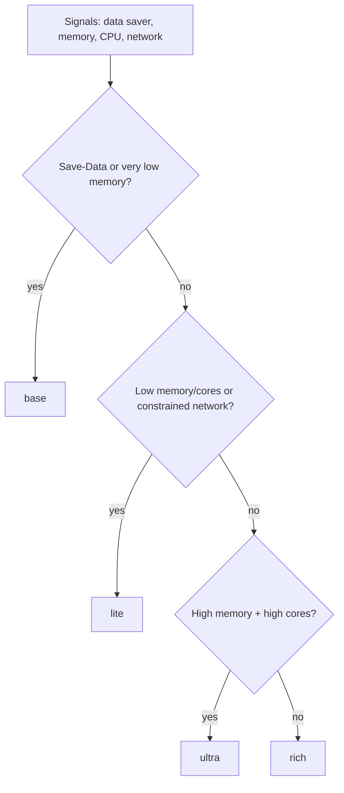
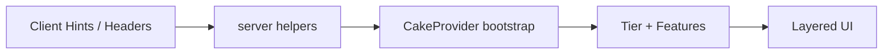

# 🎂 **Birthday-Cake Loading (BCL)**

**Capability-first progressive enhancement for React + Next.js.**

**Why BCL?**
- ⚡ **Fast time-to-content** with baseline-first rendering.
- 🧁 **True progressive enhancement** (upgrade only when the device can afford it).
- ♿ **Accessibility-first** with reduced-motion/data respect built in.
- 🌿 **Respects user preferences** (`Save-Data`, `prefers-reduced-*`).
- 🪶 **Tiny runtime** and tree-shakeable exports.
- ✅ **Next.js-ready** with a zero-config feel.

[](https://www.npmjs.com/package/@shiftbloom-studio/birthday-cake-loading)
[](https://www.npmjs.com/package/@shiftbloom-studio/birthday-cake-loading)
[](Apache-2.0)
[](https://github.com/shiftbloom-studio/birthday-cake-loading)
[](https://github.com/shiftbloom-studio/birthday-cake-loading/actions)

## 🚀 Quickstart

```bash
npm install @shiftbloom-studio/birthday-cake-loading
```

```tsx
"use client";

import {
  CakeProvider,
  CakeWatch,
  CakeLayer,
  CakeUpgrade,
  useCakeFeatures
} from "@shiftbloom-studio/birthday-cake-loading";

const MotionStatus = () => {
  const { motion } = useCakeFeatures();
  return <p>Motion: {String(motion)}</p>;
};

export default function Page() {
  return (
    <CakeProvider
      config={{ watchtower: { enabled: true, sensitivity: "medium", targets: ["hero", "gallery"] } }}
    >
      <CakeWatch />
      <main>
        <CakeLayer minTier="rich" watchKey="hero" fallback={<div>Static hero</div>}>
          <div>Animated hero</div>
        </CakeLayer>

        <CakeUpgrade
          strategy="idle"
          minTier="rich"
          watchKey="gallery"
          loader={() => import("./rich-gallery")}
          fallback={<div>Static gallery</div>}
        />

        <MotionStatus />
      </main>
    </CakeProvider>
  );
}
```

## ✨ Key Features

| Feature | What you get | Why it matters |
| --- | --- | --- |
| Tiering (`base → ultra`) | Signal-driven capability buckets | Predictable, conservative upgrades |
| Feature flags | `motion`, `richImages`, `audio`, etc. | Easy gating without bespoke logic |
| SSR/Client Hints | `@shiftbloom-studio/birthday-cake-loading/server` helpers | Fast first paint, consistent tiering |
| `CakeLayer` + `CakeUpgrade` | Render/lazy-load by tier | Smooth progressive enhancement |
| Overrides + DevTools | Session override + in-app panel | QA and demos become trivial |

## 🆚 Comparison

| Approach | Bundle impact | Accessibility | Progressive enhancement | Server-first |
| --- | --- | --- | --- | --- |
| BCL | **Tiny** | **Built-in** | **Automatic** | **Yes** |
| Manual feature flags | Medium | Manual | Manual | Optional |
| Device sniffing | Medium | Inconsistent | Risky | Optional |
| “Everything on” | Large | Often skipped | None | No |

## 🧠 How tiering decides



## 📡 Signal flow



## 🧩 Optional Signal Matrix (privacy-safe tuning)

For known device/browser quirks (ex: animation issues on certain mobile setups), BCL can apply
an **optional, coarse signal matrix** that nudges tiers without invasive fingerprinting.

```tsx
<CakeProvider
  config={{
    advanced: {
      signalMatrix: true,
      signalMatrixRules: [
        {
          id: "custom-low-memory-mobile",
          when: { userAgentMobile: true, maxDeviceMemoryGB: 3 },
          adjust: { maxTier: "lite" }
        }
      ]
    }
  }}
>
  {children}
</CakeProvider>
```

The built-in matrix uses only **non-unique** signals (reduced motion/data, coarse
memory/CPU, mobile hint, and network class) and can be overridden by ID.

## 🔌 Server bootstrap (Next.js)

```ts
import { getServerCakeBootstrapFromHeaders } from "@shiftbloom-studio/birthday-cake-loading/server";

const bootstrap = getServerCakeBootstrapFromHeaders(headers());
```

## 🛰️ CakeWatchtower (runtime jank guard)

`CakeWatch` is an opt-in component that listens for frame drops + long tasks. When jank is
detected, it can temporarily downgrade specific rich layers to their static fallbacks (no layout
flicker by default thanks to opacity swaps).

```tsx
import { CakeProvider, CakeWatch, CakeLayer } from "@shiftbloom-studio/birthday-cake-loading";

export default function App() {
  return (
    <CakeProvider config={{ watchtower: { enabled: true, sensitivity: "medium" } }}>
      <CakeWatch />
      <CakeLayer watchKey="particles" fallback={<div>Static background</div>}>
        <div>Particles + motion</div>
      </CakeLayer>
    </CakeProvider>
  );
}
```

```tsx
// app/layout.tsx
import { headers } from "next/headers";
import { getServerCakeBootstrapFromHeaders } from "@shiftbloom-studio/birthday-cake-loading/server";

export default function RootLayout({ children }: { children: React.ReactNode }) {
  const bootstrap = getServerCakeBootstrapFromHeaders(headers());
  return (
    <html lang="en">
      <body>{children}</body>
    </html>
  );
}
```

## 🧪 Testing

```bash
npm test
```

## 📜 License

Apache-2.0
